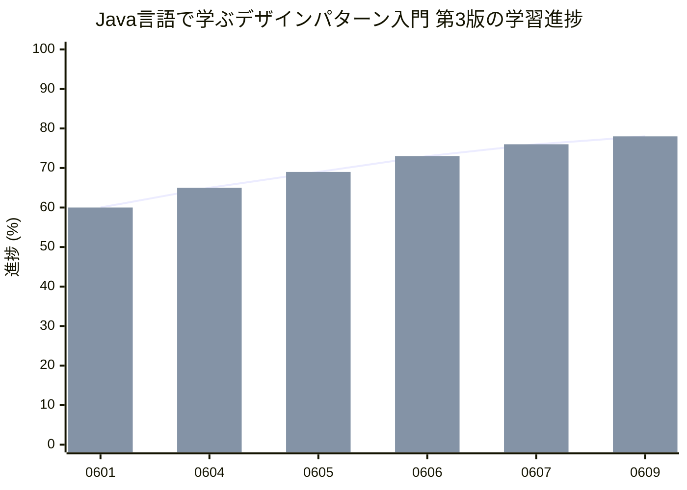

# この記事は何?
2024/06/10 〜 2024/07/17の期間、Qiitaで

* **[Qiita Engineer Festa 2024](https://qiita.com/official-campaigns/engineer-festa/2024)**

が開催されています。

テーマのひとつに

* **[お題は不問！Qiita Engineer Festa 2024で記事投稿！](https://qiita.com/official-events/16baee61b1d8bd4aac5a)**

がありました。
テーマに該当する**mermaidのxychartで学習進捗を可視化する**記事です。


# 背景
私は現在、別記事に書いた **[UMTPレベル3という資格試験の学習](https://qiita.com/juraruming/items/c700ae7718c2cc2a5d65)** をしています。

学習方法としてGitHubのコントリビューションのグラフを使い、学びの習慣をつくることをやっています。
[こちらの記事](https://qiita.com/juraruming/items/4950663fb50de36a5fe0)が具体的な手法の紹介です。

この手法で学びの習慣はできてきましたが、

* 学習の進捗を可視化し、ゴールを見据えて学びたい

と思うようになりました。

現在は技術書のサンプルコードを写経、コミット・プッシュしGitHubのコントリビューションのグラフに記録しています。

この際に学習進捗も更新していけば、

* 学習進捗の見える化でモチベーションアップ
* ゴールを意識した学びができる

と思いました。

そこでマークダウンに進捗を表すグラフを表示できないか、と考えました。


# 学習進捗の可視化
マークダウンでグラフ表示する手段を調べていて**mermaidのxychart**で実現できそうなことがわかりました。

そこで以下のようなマークダウンを記述し、学習進捗を記録するようにしました。

```
>* 進捗メモ（2024/6/9 23:26）
>  * サンプルプログラム実施進捗: 19 / 23 = 82 (%)
>  * 練習問題実施進捗: 17 / 23 = 73 (%)
>  * 全体: 36 / 46 = 78 (%)

// 実際は```mermaid と ``` でxychart-betaを括っています。
xychart-beta
    title "Java言語で学ぶデザインパターン入門 第3版の学習進捗"
    x-axis [0601, 0604, 0605, 0606, 0607, 0609]
    y-axis "進捗 (%)" 0 --> 100
    line  [60, 65, 69, 73, 76, 78]
    bar   [60, 65, 69, 73, 76, 78]
```

プレビューするとつぎのようなチャートが表示されます。



このようなチャートを表示することができ、日々の学習進捗状況を可視化することができました。

学習の進捗状況がパッと見て、把握することができるようになりました。
つぎの効果が得られています。

* 進捗を上げなければ!、という気になる
* 頑張っているな、ということがわかり自己肯定感のアップ

個人的に良い施策となりました。

最後まで読んでいただきありがとうございました。
